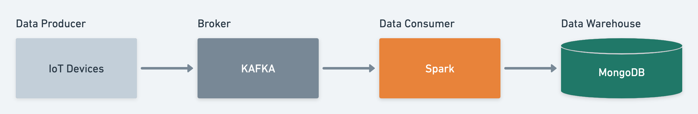
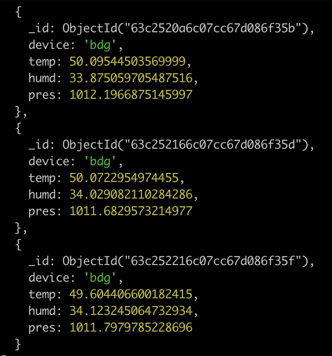

# Spark Structured Streaming

## Overview
Mock data pipeline which reads a stream of sensor data, aggregates it slightly, then saves it to a database.

## Tech Stack
* Python
* Apache Kafka
* Apache Spark
* MongoDB

## Architecture


## Quick Start
Before you run this code, you must have installed Python 3, Apache Kafka, Apache Spark, JDK 8, and MongoDB.

Run data producer
```
python data_producer/producer.py jkt
```
* jkt means device name

Run data consumer
```
python data_consumer/consumer.py
```

## Dataset
- Device
- Temperature
- Humd
- Press

## Output
* Device
* AVG Temp
* AVG Humd
* AVG Pres


